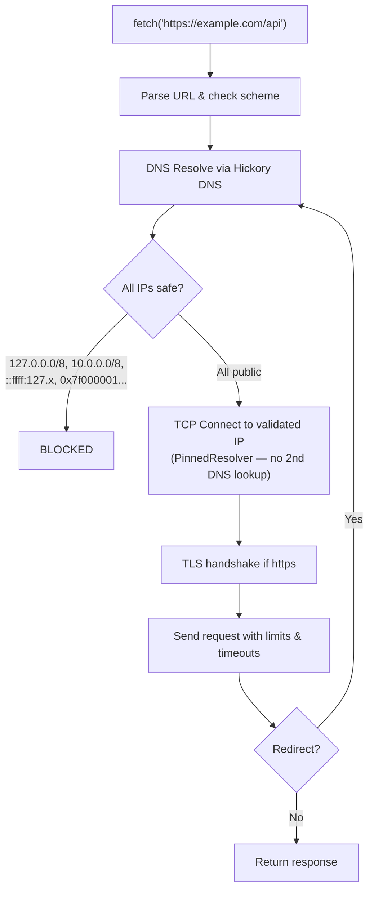

# agent-fetch

A sandboxed HTTP client designed for AI agents and agentic applications. When agents need to make HTTP calls, they shouldn't be able to reach internal infrastructure, exfiltrate data to private networks, or get tricked by DNS rebinding. `agent-fetch` enforces a security policy on every request before any connection is made.

Available as a Rust crate and as an npm package with native Node.js bindings.

## Why

AI agents increasingly need to fetch URLs — calling APIs, scraping pages, pulling data. Giving them unrestricted HTTP access is dangerous. `agent-fetch` is a drop-in HTTP client that applies SSRF protection, domain policies, rate limiting, and resource controls so you can let agents make network calls safely.

## What it blocks

- Private/internal IPs (loopback, RFC 1918, link-local, cloud metadata, multicast)
- DNS rebinding (resolves DNS upfront, pins connections to validated IPs)
- IP encoding tricks (hex, octal, decimal — normalized before validation)
- Redirect-based SSRF (re-validates every redirect target)
- Unauthorized domains (allowlist/blocklist support)
- Resource exhaustion (rate limiting, body size limits, timeouts)

## How it works

agent-fetch performs DNS resolution, IP validation, and TCP connection as a single atomic operation. When a request is made, the library resolves the hostname using its own DNS resolver (Hickory DNS), checks every resolved IP address against a comprehensive blocklist (private ranges, loopback, link-local, IPv4-mapped IPv6, and other non-routable addresses), then connects directly to the validated IP — bypassing the runtime's default DNS resolution entirely. This eliminates the time-of-check-to-time-of-use (TOCTOU) gap that makes DNS rebinding attacks possible. On redirects, the full validation cycle repeats for each new hostname. Additional protections include request/response body size limits, timeouts, rate limiting, and scheme restrictions.



## Installation

```sh
npm install @parassharmaa/agent-fetch
```

## Usage

```js
const { SafeHttpClient } = require('@parassharmaa/agent-fetch');

const client = new SafeHttpClient({
  allowedDomains: ['*.example.com'],
  blockedDomains: ['internal.example.com'],
  maxRedirects: 3,
  requestTimeoutMs: 5000,
});

const response = await client.fetch('https://api.example.com/data', {
  method: 'POST',
  headers: { 'Content-Type': 'application/json' },
  body: Buffer.from(JSON.stringify({ key: 'value' })),
});

console.log(response.status);
console.log(response.headers);
console.log(response.body.toString());
```

## License

MIT
